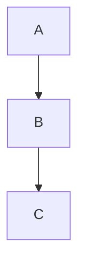

# Obsidian Vault Management

This workspace is an **Obsidian.md vault** — a local folder of interconnected Markdown notes. The agent should treat all `.md` files as Obsidian notes and follow Obsidian conventions when creating or editing them.

## Vault Structure

```
obsidian_notes/
├── .obsidian/            # Vault config (DO NOT edit unless asked)
├── templates/            # Note templates (configured in .obsidian/templates.json)
├── Agent/                # Agent work logs and project notes
└── *.md                  # Top-level notes
```

### Key conventions in this vault
- Notes live at the root or in topic folders (`Agent/`, `templates/`)
- The `templates/` folder is the configured template directory
- `Agent/PROJECT-*.md` files are append-only agent work logs — see their embedded instructions before editing
- One community plugin installed: **Terminal**

## Obsidian Flavored Markdown

When writing or editing notes, use **Obsidian Flavored Markdown** (superset of CommonMark + GFM):

### Internal links (wikilinks)
```markdown
[[Note Name]]              # Link to another note
[[Note Name|Display Text]] # Link with alias
[[Note Name#Heading]]      # Link to a heading
[[Note Name#^block-id]]    # Link to a block
```

### Embeds
```markdown
![[Note Name]]             # Embed entire note
![[Note Name#Heading]]     # Embed a section
![[image.png]]             # Embed an image
```

### Tags
```markdown
#tag-name                  # Inline tag
```

### Callouts
```markdown
> [!note] Title
> Callout body text

> [!warning] Title
> Warning callout

> [!tip] Title
> Tip callout
```
Other callout types: `info`, `todo`, `example`, `quote`, `bug`, `danger`, `success`, `question`, `failure`, `abstract`.

### Frontmatter (YAML properties)
```markdown
---
title: Note Title
tags: [tag1, tag2]
date: 2026-02-04
aliases: [alternate-name]
---
```

### Task lists
```markdown
- [ ] Incomplete task
- [x] Completed task
```

### Footnotes
```markdown
This has a footnote[^1].
[^1]: Footnote content here.
```

### Math (LaTeX)
```markdown
Inline: $E = mc^2$
Block:
$$
\int_0^\infty e^{-x} dx = 1
$$
```

### Mermaid diagrams
````markdown

````

## Creating Notes

When creating a new note:

1. **Choose location** — put notes at the vault root unless a relevant subfolder exists
2. **Add frontmatter** if the note has metadata (tags, dates, aliases)
3. **Use wikilinks** (`[[Other Note]]`) to connect to existing notes — never use relative file paths for internal links
4. **Use descriptive filenames** — Obsidian uses the filename as the note title

### Template variables

Templates in `templates/` support these variables:
- `{{title}}` — note title
- `{{date}}` — current date
- `{{time}}` — current time

## Editing Notes

- **Preserve wikilinks** — never convert `[[wikilinks]]` to standard markdown links
- **Preserve frontmatter** — keep existing YAML frontmatter intact; add fields, don't remove
- **Preserve callouts** — maintain `> [!type]` syntax
- **Append-only logs** — files like `Agent/PROJECT-*.md` have explicit append-only rules; read the file's instructions section before editing

## Things to Avoid

- **Do not edit `.obsidian/`** config files unless explicitly asked
- **Do not use standard markdown links** (`[text](path.md)`) for internal vault links — use `[[wikilinks]]` instead
- **Do not nest vaults** — never create a `.obsidian` folder inside a subfolder
- **Do not create notes in `.obsidian/`** — that folder is for configuration only
- **Do not remove or reorder entries** in append-only log files
